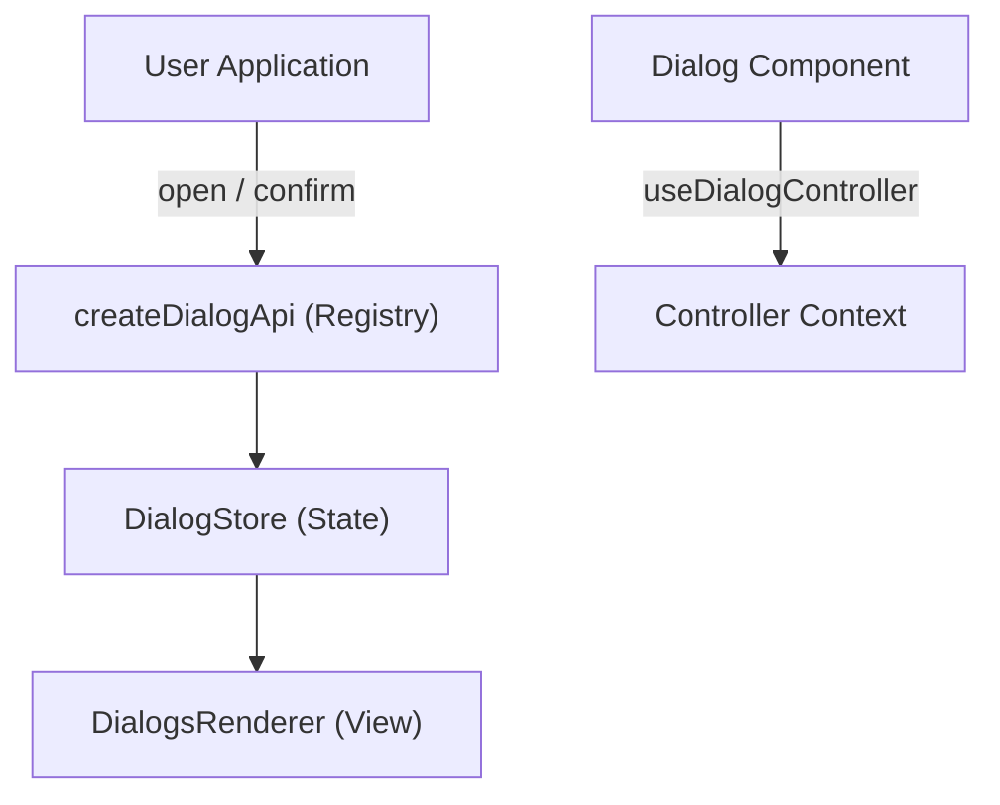

# React Layered Dialog   

React 18 `useSyncExternalStore` 기반 경량 다이얼로그 매니저

---

## Architecture Overview

`react-layered-dialog`는 상태 저장소(Store), 렌더러(Renderer), 그리고 고수준 API(Registry)를 분리하여 유연한 다이얼로그 관리를 제공합니다.



1. **DialogStore**: 모든 다이얼로그의 상태(열림/닫힘, z-index, props, status)를 관리합니다.
2. **DialogsRenderer**: 스토어의 상태를 구독하여 실제 DOM에 다이얼로그를 렌더링합니다.
3. **createDialogApi**: 다이얼로그 컴포넌트를 등록하고 타입 안정성이 보장된 메서드를 생성합니다.
4. **useDialogController**: 컴포넌트 내부에서 자신의 상태를 제어(update, close, resolve 등)하기 위한 훅입니다.

---

## Hello World (Single File Example)

아래는 `react-layered-dialog`를 사용하는 가장 간단한 방법입니다.

```tsx
import { DialogStore, createDialogApi, DialogsRenderer, useDialogController } from 'react-layered-dialog';

// 1. 스토어 및 API 생성
const store = new DialogStore();
const dialog = createDialogApi(store, {
  alert: { component: ({ message }) => {
    const { close, unmount, zIndex } = useDialogController();
    return (
      <div style={{ position: 'fixed', top: '20%', left: '50%', transform: 'translateX(-50%)', background: 'white', padding: '20px', border: '1px solid black', zIndex }}>
        <p>{message}</p>
        <button onClick={() => { close(); unmount(); }}>닫기</button>
      </div>
    );
  }}
});

// 2. 앱에서 사용
function App() {
  return (
    <>
      <button onClick={() => dialog.alert({ message: 'Hello World!' })}>알림 열기</button>
      <DialogsRenderer store={store} />
    </>
  );
}
```

---

## Installation

```bash
pnpm add react-layered-dialog
# or
npm i react-layered-dialog
```

---

## 핵심 메서드 비교

사용 사례에 따라 동기(`open`) 또는 비동기(`openAsync` / `confirm`) 방식을 선택할 수 있습니다.

| 메서드 | 반환값 | 주요 특징 | 권장 상황 |
| :--- | :--- | :--- | :--- |
| **`open`** | `DialogOpenResult` (Handle) | 즉시 핸들을 반환하여 외부에서 업데이트/닫기 가능 | 단순 알림, 지속적인 업데이트가 필요한 다이얼로그 |
| **`openAsync`** | `Promise<DialogAsyncResult>` | 사용자의 명시적 응답(resolve)이 있을 때까지 대기 | 폼 입력, 삭제 확인 등 결과가 필요한 흐름 |
| **`confirm`** | `Promise<DialogAsyncResult>` | `openAsync`의 별칭으로, 등록된 설정(mode: async) 활용 | 전형적인 확인/취소 시나리오 |

---

## Why React Layered Dialog?

- **Type-safe Registry**: 컴포넌트 등록 시점부터 호출까지 완전한 타입 추론을 지원합니다.
- **Controller Pattern**: 컴포넌트 내부에서 `getProps(props)`를 통해 초기 Props와 업데이트된 상태를 안전하게 병합합니다.
- **Automatic Z-Index**: 다이얼로그가 층층이 쌓일 때 레이어 순서를 자동으로 관리합니다.
- **Headless & Flexible**: UI 프레임워크나 애니메이션 라이브러리에 의존하지 않아 자유로운 디자인이 가능합니다.

> [!WARNING]
> **Next.js/SSR 환경에서 사용 시 주의**: 전역 스토어를 서버에서 생성하면 다른 사용자의 모달 상태가 공유될 수 있습니다. 반드시 [SSR 가이드](./docs/advanced/ssr.md)를 확인하세요.

---

## More Resources

- [공식 문서 (Live Demo)](https://seunjin.github.io/react-layered-dialog/)
- [시작하기 가이드](./docs/index.md)
- [애니메이션 적용 가이드](./docs/guides/animations.md)
- [API Reference](./docs/api/dialog-store.md)

---

## Contributing

이 프로젝트는 Conventional Commits 명세를 따릅니다. 버전 관리는 Changesets를 사용합니다. 자세한 내용은 [릴리즈 가이드](./docs/contributing/releasing.md)를 참고하세요.
