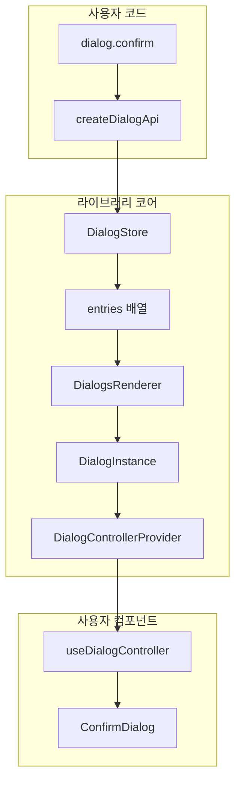

# 코드베이스 분석 (Codebase Analysis)

> `react-layered-dialog` 라이브러리의 아키텍처와 모듈 구조를 분석합니다.

---

## 1. 아키텍처 개요



### 데이터 흐름

1. **열기**: `dialog.confirm()` → `store.open()` → `entries` 배열에 추가 → 리렌더링
2. **닫기**: `controller.close()` → `isOpen=false` → 애니메이션 → `unmount()` → 배열에서 제거
3. **업데이트**: `controller.update()` → `state` 변경 → 리렌더링

---

## 2. 모듈 구조

```
package/src/
├── index.ts          # Public API exports
├── store.ts          # DialogStore 클래스 (핵심 상태 관리)
├── registry.ts       # createDialogApi, defineDialog (고수준 API)
├── renderer.tsx      # DialogsRenderer, useDialogController (React 통합)
├── controller.tsx    # DialogControllerContext (내부 Context)
└── types.ts          # 모든 타입 정의
```

---

## 3. 모듈별 상세 분석

### 3.1 `store.ts` - DialogStore

**역할**: 다이얼로그 스택을 관리하는 핵심 스토어

**주요 속성**:
| 속성 | 타입 | 설명 |
|------|------|------|
| `entries` | `DialogEntry[]` | 현재 열린 다이얼로그 스택 |
| `listeners` | `Set<DialogListener>` | 상태 변경 구독자 |
| `baseZIndex` | `number` | 기본 z-index (기본값: 1000) |
| `nextZIndex` | `number` | 다음 다이얼로그에 할당할 z-index |

**주요 메서드**:
| 메서드 | 반환 타입 | 설명 |
|--------|----------|------|
| `open(renderer, options?)` | `DialogOpenResult` | 새 다이얼로그 열기 |
| `openAsync(renderer, options?)` | `Promise<DialogAsyncResult>` | Promise 기반 다이얼로그 |
| `close(id?)` | `void` | isOpen=false 설정 |
| `unmount(id?)` | `void` | 스택에서 완전 제거 |
| `update(id, updater)` | `void` | 상태 업데이트 |
| `closeAll()` | `void` | 모든 다이얼로그 닫기 |
| `unmountAll()` | `void` | 모든 다이얼로그 제거 |
| `subscribe(listener)` | `() => void` | 상태 변경 구독 |
| `getSnapshot()` | `DialogStoreSnapshot` | 현재 스냅샷 반환 |

**특이사항**:
- `useSyncExternalStore` 호환을 위한 External Store 패턴
- z-index 자동 증가 및 리셋 로직
- 중복 ID 방지 로직

---

### 3.2 `registry.ts` - createDialogApi, defineDialog

**역할**: 레지스트리 기반 고수준 API 생성

**주요 함수**:

#### `defineDialog(component, options?)`
```ts
defineDialog(ConfirmDialog, { mode: 'async', displayName: 'Confirm' })
```
- 컴포넌트를 다이얼로그 정의로 래핑
- `mode`: `'sync'` | `'async'` (기본값: `'sync'`)

#### `createDialogApi(store, registry)`
```ts
const dialog = createDialogApi(store, {
  confirm: { component: ConfirmDialog, mode: 'async' },
  alert: { component: AlertDialog },
});
// dialog.confirm(), dialog.alert() 사용 가능
```
- 레지스트리 키 기반으로 타입 안전한 메서드 자동 생성
- 기본 스토어 메서드도 함께 노출 (`open`, `close`, `update` 등)

---

### 3.3 `renderer.tsx` - DialogsRenderer, useDialogController

**역할**: React 통합 및 렌더링

#### `DialogsRenderer`
```tsx
<DialogsRenderer store={dialogStore} />
```
- `useSyncExternalStore`로 스토어 구독
- `entries`를 순회하며 `DialogInstance` 렌더링

#### `useDialogController<TProps>()`
```tsx
const { isOpen, close, unmount, update, state, zIndex } = useDialogController<MyProps>();
```
- 현재 다이얼로그의 컨트롤러 컨텍스트 접근
- 제네릭으로 상태 타입 지정 가능

---

### 3.4 `types.ts` - 타입 정의

**주요 타입**:

| 타입 | 설명 |
|------|------|
| `DialogEntry` | 스택에 저장되는 단일 다이얼로그 정보 |
| `DialogControllerContextValue` | 컨트롤러 훅에서 반환하는 값 |
| `DialogOpenResult` | `open()` 반환값 (핸들, 제어 함수) |
| `DialogAsyncResult` | `openAsync()` Promise 결과 |
| `DialogStatus` | `'idle'` \| `'loading'` \| `'done'` \| `'error'` |
| `OpenDialogOptions` | `open()` 옵션 (id, zIndex, componentKey) |

---

## 4. 확장 포인트

### 4.1 커스텀 스토어 옵션
```ts
new DialogStore({ baseZIndex: 5000 })
```

### 4.2 레지스트리 확장
```ts
const dialog = createDialogApi(store, {
  ...baseRegistry,
  customDialog: defineDialog(CustomComponent),
});
```

### 4.3 컨트롤러 확장
- `getStateField`, `getStateFields`로 props/state 병합
- `resolve`, `reject`로 비동기 흐름 제어

---

## 5. 테스트 커버리지

현재 테스트 (`index.test.ts`):

| 테스트 케이스 | 상태 |
|--------------|------|
| `open` adds entry and allows updates | ✅ |
| `openAsync` resolves via async handlers | ✅ |
| opens sync dialogs via registry | ✅ |
| supports async dialogs via registry | ✅ |
| respects `baseZIndex` option | ✅ |

**미포함 케이스**:
- `closeAll` / `unmountAll`
- 중복 ID 에러
- `reject` 시나리오
- 엣지 케이스 (빈 스택에서 close 등)
